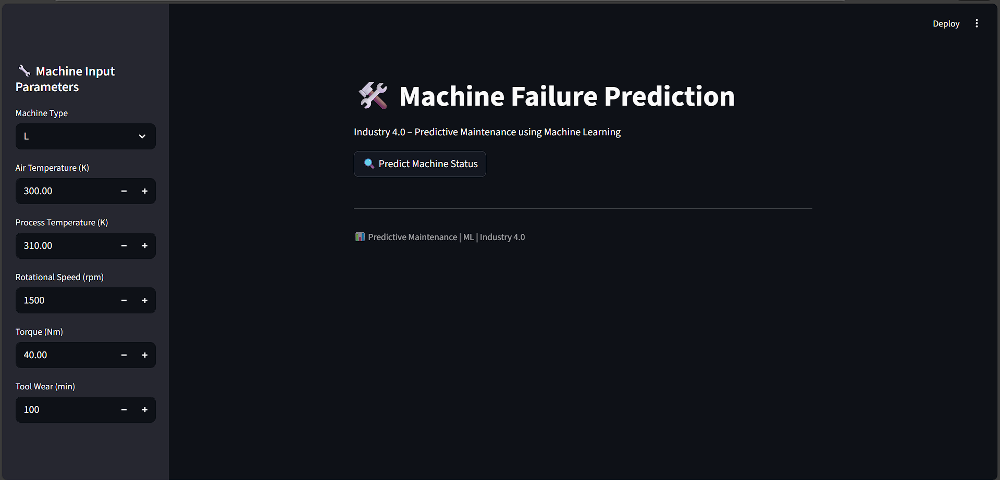

# 🛠️ Predictive Maintenance – Machine Failure Prediction

## 📌 Project Overview
This project focuses on **predicting machine failures in manufacturing environments** using **Machine Learning** and deploying the solution as an **interactive Streamlit web application**.

The goal is to help industries **reduce downtime, prevent unexpected failures, and optimize maintenance costs**, aligning with **Industry 4.0** practices.

---

## 🏭 Problem Statement
Unexpected machine failures can lead to:
- Production downtime
- High maintenance costs
- Safety risks

This project predicts whether a machine is **likely to fail or operate normally** based on sensor data, enabling **proactive maintenance decisions**.

---

## 📊 Dataset Information
- **Dataset Name:** AI4I 2020 Predictive Maintenance Dataset  
- **Source:** UCI Machine Learning Repository  
- **Records:** 10,000+  
- **Target Variable:** `Machine failure` (0 = No, 1 = Yes)

### 🔑 Key Features
| Feature | Description |
|------|-----------|
| Type | Machine type (L, M, H) |
| Air temperature [K] | Ambient temperature |
| Process temperature [K] | Machine process temperature |
| Rotational speed [rpm] | Shaft rotation speed |
| Torque [Nm] | Rotational force |
| Tool wear [min] | Tool usage duration |
| TWF, HDF, PWF, OSF, RNF | Failure indicators |

---

## 🧠 Machine Learning Approach
- **Algorithm Used:** Random Forest Classifier
- **Why Random Forest?**
  - Handles non-linear relationships well
  - Robust to noise
  - High accuracy for tabular data

### ⚙️ Model Pipeline
1. Data Cleaning & Preprocessing  
2. Feature Encoding  
3. Train–Test Split (80% / 20%)  
4. Model Training  
5. Evaluation  
6. Model Serialization (`model.pkl`)

---

## 📈 Model Performance
- High accuracy on unseen data
- Balanced performance for failure vs non-failure cases
- Suitable for real-world manufacturing environments

---

## 🌐 Streamlit Web Application
An interactive **Streamlit app** is built to allow users to:
- Input machine parameters
- Predict failure in real time
- Receive clear alerts:
  - ⚠️ *Machine likely to fail*
  - ✅ *Machine operating normally*

### 🖥️ App Preview

---

## 🗂️ Project Structure
Predictive-Maintenance-ML/
│
├── ai4i2020.csv # Dataset
├── predictive_maintenance_machine_failure.ipynb # Model training notebook
├── model.pkl # Trained ML model
├── rf_model # Random Forest model artifact
├── app.py # Streamlit application
├── ScreenShot.png # App screenshot
├── README.md # Project documentation

---

## ▶️ How to Run the Project

### 1️⃣ Install Dependencies
- pip install -r requirements.txt

---  
  
### 2️⃣ Run Streamlit App
- streamlit run app.py

---

## 🧪 Technologies Used
- Python
- Pandas, NumPy
- Scikit-learn
- Matplotlib, Seaborn
- Streamlit
- Joblib

## 🎯 Use Cases
- Manufacturing plants
- Predictive maintenance teams
- Industry 4.0 applications
- Smart factories

## 🚀 Future Enhancements
- Feature importance visualization
- Model explainability (SHAP)
- Real-time IoT sensor integration
- Cloud deployment

## 👨‍💻 Author
- Anurag Kokate
- Machine Learning & Data Science Enthusiast
- LinkedIn: https://www.linkedin.com/in/anuragkokate09
- GitHub: https://github.com/Anuragkokate09
